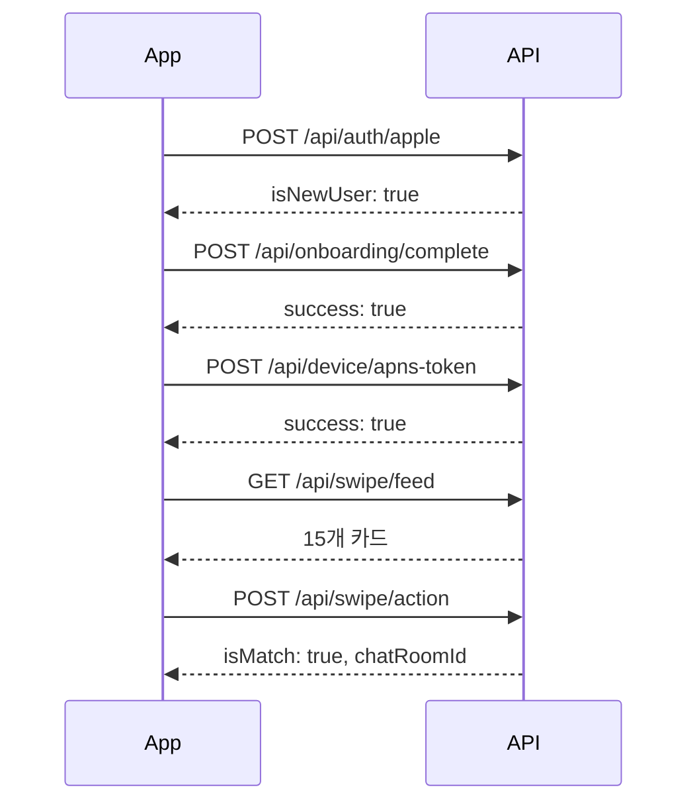
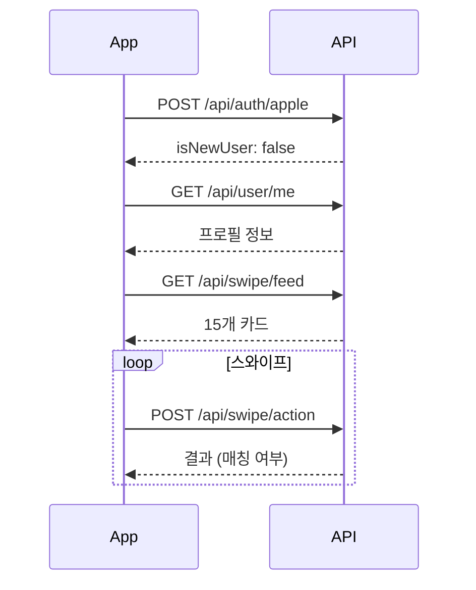

# 🚀 Crush AI - API 문서

**작성일:** 2024-11-05  
**버전:** 1.0  
**Base URL:** `https://api.crushai.com` (프로덕션) 또는 개발 서버 URL

---

## 📋 목차

1. [인증 (Authentication)](#1-인증-authentication)
2. [회원가입 & 온보딩](#2-회원가입--온보딩)
3. [사용자 관리](#3-사용자-관리)
4. [스와이프 & 매칭](#4-스와이프--매칭)
5. [차단 & 신고](#5-차단--신고)
6. [디바이스 & 알림](#6-디바이스--알림)
7. [AI 분석](#7-ai-분석)
8. [API 호출 흐름](#8-api-호출-흐름)
9. [에러 처리](#9-에러-처리)

---

## 🔐 인증 방식

### Authorization Header
모든 인증이 필요한 API는 다음 헤더를 포함해야 합니다:

```http
Authorization: Bearer <access_token>
```

### 토큰 종류
- **Access Token:** 실제 API 호출에 사용 (유효기간: 30분)
- **Refresh Token:** Access Token 갱신용 (유효기간: 14일)

### 토큰 갱신 플로우
```
1. API 호출 → 401 에러 수신
2. POST /api/reissue (Refresh Token 사용)
3. 새 Access Token 받음
4. 원래 API 재호출
```

---

## 1. 인증 (Authentication)

### 1.1 Apple 로그인

Apple ID Token으로 로그인 또는 회원가입합니다.

**Endpoint:** `POST /api/auth/apple`  
**인증 필요:** ❌ No

**Request:**
```json
{
  "idToken": "eyJhbGciOiJSUzI1NiIsInR5cCI6IkpXVCJ9..."
}
```

**Response (200 OK):**
```json
{
  "accessToken": "eyJhbGciOiJIUzI1NiIsInR5cCI6IkpXVCJ9...",
  "refreshToken": "eyJhbGciOiJIUzI1NiIsInR5cCI6IkpXVCJ9...",
  "isNewUser": true,
  "onboardingCompleted": false
}
```

| 필드 | 타입 | 설명 |
|------|------|------|
| accessToken | string | API 호출용 액세스 토큰 (30분 유효) |
| refreshToken | string | 토큰 갱신용 리프레시 토큰 (14일 유효) |
| isNewUser | boolean | 신규 가입 여부 (true면 온보딩 필요) |
| onboardingCompleted | boolean | 온보딩 완료 여부 |

**Error Responses:**
- `400` - 잘못된 ID Token
- `401` - 유효하지 않은 토큰

---

### 1.2 Google 로그인

Google ID Token으로 로그인 또는 회원가입합니다.

**Endpoint:** `POST /api/auth/google`  
**인증 필요:** ❌ No

**Request:**
```json
{
  "idToken": "eyJhbGciOiJSUzI1NiIsInR5cCI6IkpXVCJ9..."
}
```

**Response:** Apple 로그인과 동일

---

### 1.3 토큰 갱신

Refresh Token으로 새로운 Access Token을 발급받습니다.

**Endpoint:** `POST /api/reissue`  
**인증 필요:** ❌ No (Refresh Token 필요)

**Request Header:**
```http
Refresh: <refresh_token>
```

**Response (200 OK):**
```json
{
  "accessToken": "eyJhbGciOiJIUzI1NiIsInR5cCI6IkpXVCJ9...",
  "refreshToken": "eyJhbGciOiJIUzI1NiIsInR5cCI6IkpXVCJ9..."
}
```

**Error Responses:**
- `400` - Refresh token 없음
- `401` - 만료되거나 유효하지 않은 토큰

---

### 1.4 로그아웃

사용자 로그아웃 처리 (토큰 무효화)

**Endpoint:** `POST /api/logout`  
**인증 필요:** ✅ Yes

**Response (200 OK):**
```json
{
  "message": "Logout successful"
}
```

---

## 2. 회원가입 & 온보딩

### 2.1 온보딩 완료

사용자 프로필 정보를 등록하여 회원가입을 완료합니다.

**Endpoint:** `POST /api/onboarding/complete`  
**인증 필요:** ✅ Yes

**Request:**
```json
{
  "nickname": "Kevin",
  "gender": "MALE",
  "birthDate": "1995-05-15",
  "location": "Seoul, South Korea",
  "photoUrls": [
    "https://cdn.crushai.com/photos/user1_1.jpg",
    "https://cdn.crushai.com/photos/user1_2.jpg"
  ],
  "bio": "Love traveling and coffee ☕",
  "interests": ["Travel", "Coffee", "Music"],
  "showMeGender": ["FEMALE", "NON_BINARY"]
}
```

| 필드 | 타입 | 필수 | 설명 |
|------|------|------|------|
| nickname | string | ✅ | 닉네임 (2-20자) |
| gender | enum | ✅ | `MALE`, `FEMALE`, `NON_BINARY` |
| birthDate | string | ✅ | 생년월일 (YYYY-MM-DD) |
| location | string | ✅ | 위치 정보 |
| photoUrls | array | ✅ | 프로필 사진 URL (최소 1개) |
| bio | string | ❌ | 자기소개 (최대 500자) |
| interests | array | ❌ | 관심사 목록 |
| showMeGender | array | ✅ | 선호 성별 (여러 개 가능) |

**Response (200 OK):**
```json
{
  "success": true,
  "message": "Onboarding completed successfully",
  "userId": 123
}
```

**Error Responses:**
- `400` - 필수 필드 누락 또는 유효하지 않은 데이터
- `409` - 이미 온보딩 완료된 사용자

---

## 3. 사용자 관리

### 3.1 내 프로필 조회

현재 로그인한 사용자의 프로필 정보를 조회합니다.

**Endpoint:** `GET /api/user/me`  
**인증 필요:** ✅ Yes

**Response (200 OK):**
```json
{
  "userId": 123,
  "username": "user123@apple.com",
  "nickname": "Kevin",
  "gender": "MALE",
  "age": 29,
  "location": "Seoul, South Korea",
  "photoUrls": [
    "https://cdn.crushai.com/photos/user1_1.jpg",
    "https://cdn.crushai.com/photos/user1_2.jpg"
  ],
  "bio": "Love traveling and coffee ☕",
  "interests": ["Travel", "Coffee", "Music"],
  "showMeGender": ["FEMALE"],
  "onboardingCompleted": true
}
```

---

### 3.2 프로필 수정

사용자 프로필 정보를 수정합니다.

**Endpoint:** `PUT /api/user/profile`  
**인증 필요:** ✅ Yes

**Request:**
```json
{
  "nickname": "Kevin Kim",
  "location": "Busan, South Korea",
  "photoUrls": [
    "https://cdn.crushai.com/photos/user1_new.jpg"
  ],
  "bio": "Updated bio",
  "interests": ["Travel", "Food", "Photography"],
  "showMeGender": ["FEMALE", "NON_BINARY"]
}
```

**Response (200 OK):**
```json
{
  "success": true,
  "message": "Profile updated successfully"
}
```

---

### 3.3 회원 탈퇴

사용자 계정을 삭제합니다 (소프트 삭제).

**Endpoint:** `DELETE /api/user/account`  
**인증 필요:** ✅ Yes

**Response (200 OK):**
```json
{
  "success": true,
  "message": "Account deleted successfully"
}
```

**⚠️ 주의사항:**
- 계정은 즉시 삭제되지 않고 30일 후 완전 삭제됩니다
- 30일 이내 재로그인 시 계정 복구 가능합니다

---

## 4. 스와이프 & 매칭

### 4.1 초기 피드 조회

스와이프 가능한 사용자 카드 15개를 조회합니다.

**Endpoint:** `GET /api/swipe/feed`  
**인증 필요:** ✅ Yes

**Response (200 OK):**
```json
{
  "users": [
    {
      "userId": 456,
      "nickname": "Sarah",
      "age": 27,
      "location": "Seoul, South Korea",
      "photos": [
        "https://cdn.crushai.com/photos/user456_1.jpg",
        "https://cdn.crushai.com/photos/user456_2.jpg"
      ],
      "likedByThem": true
    }
  ],
  "totalCount": 15,
  "hasMore": true
}
```

| 필드 | 타입 | 설명 |
|------|------|------|
| users | array | 사용자 카드 배열 |
| users[].likedByThem | boolean | 상대방이 나를 좋아요 했는지 (⭐ 표시용) |
| totalCount | number | 반환된 카드 수 |
| hasMore | boolean | 추가 피드 존재 여부 |

**✨ 자동 필터링:**
서버에서 다음 사용자들을 자동으로 제외합니다:
- 이미 스와이프한 사용자
- 이미 매칭된 사용자
- 차단한 사용자
- 나를 차단한 사용자
- 본인

---

### 4.2 추가 피드 조회

추가 스와이프 카드 10개를 조회합니다.

**Endpoint:** `GET /api/swipe/feed/more`  
**인증 필요:** ✅ Yes

**Response:** 초기 피드 조회와 동일 (단, totalCount는 10)

**💡 참고:**
- `excludeUserIds` 파라미터 불필요 (서버에서 자동 처리)
- 초기 피드와 동일한 필터링 적용

---

### 4.3 스와이프 액션

사용자 카드에 대해 LIKE 또는 PASS를 수행합니다.

**Endpoint:** `POST /api/swipe/action`  
**인증 필요:** ✅ Yes

**Request:**
```json
{
  "targetUserId": 456,
  "action": "LIKE"
}
```

| 필드 | 타입 | 필수 | 설명 |
|------|------|------|------|
| targetUserId | number | ✅ | 대상 사용자 ID |
| action | enum | ✅ | `LIKE` 또는 `PASS` |

**Response - LIKE & 매칭 성공 (200 OK):**
```json
{
  "isMatch": true,
  "message": "It's a match!",
  "matchedUser": {
    "userId": 456,
    "nickname": "Sarah",
    "age": 27,
    "photoUrl": "https://cdn.crushai.com/photos/user456_1.jpg"
  },
  "chatRoomId": "room_123_456"
}
```

**Response - LIKE & 매칭 실패 (200 OK):**
```json
{
  "isMatch": false,
  "message": "Liked"
}
```

**Response - PASS (200 OK):**
```json
{
  "isMatch": false,
  "message": "Passed"
}
```

**Error Responses:**
- `400` - 존재하지 않는 사용자
- `409` - 이미 스와이프한 사용자

**💕 매칭 로직:**
- A가 B를 LIKE하고, B도 A를 LIKE했을 때 매칭 성공
- 매칭 성공 시 `chatRoomId` 반환 (채팅 서비스로 이동)

---

## 5. 차단 & 신고

### 5.1 사용자 차단

특정 사용자를 차단합니다 (피드에서 제외).

**Endpoint:** `POST /api/block/{userId}`  
**인증 필요:** ✅ Yes

**Path Parameter:**
- `userId` - 차단할 사용자 ID

**Response (200 OK):**
```json
{
  "success": true,
  "message": "사용자를 차단했습니다"
}
```

**Error Responses:**
- `400` - 자기 자신 차단 시도 또는 존재하지 않는 사용자
- `409` - 이미 차단한 사용자

**🚫 차단 효과:**
- 차단한 사용자는 내 피드에 나타나지 않음
- 나도 상대방의 피드에 나타나지 않음

---

### 5.2 차단 해제

차단한 사용자를 해제합니다.

**Endpoint:** `DELETE /api/block/{userId}`  
**인증 필요:** ✅ Yes

**Path Parameter:**
- `userId` - 차단 해제할 사용자 ID

**Response (200 OK):**
```json
{
  "success": true,
  "message": "차단을 해제했습니다"
}
```

**Error Responses:**
- `400` - 차단하지 않은 사용자

---

### 5.3 사용자 신고

부적절한 사용자를 신고합니다.

**Endpoint:** `POST /api/report/user`  
**인증 필요:** ✅ Yes

**Request:**
```json
{
  "reportedUserId": 789,
  "reportType": "FAKE"
}
```

| 필드 | 타입 | 필수 | 설명 |
|------|------|------|------|
| reportedUserId | number | ✅ | 신고 대상 사용자 ID |
| reportType | enum | ✅ | `FAKE` (가짜 프로필) 또는 `SEXUAL` (성적 콘텐츠) |

**Response (200 OK):**
```json
{
  "success": true,
  "message": "신고가 접수되었습니다"
}
```

**Error Responses:**
- `400` - 자기 자신 신고 또는 존재하지 않는 사용자
- `409` - 이미 신고한 사용자

---

## 6. 디바이스 & 알림

### 6.1 APNs 토큰 등록

iOS 푸시 알림을 위한 디바이스 토큰을 등록합니다.

**Endpoint:** `POST /api/device/apns-token`  
**인증 필요:** ✅ Yes

**Request:**
```json
{
  "deviceToken": "abc123def456..."
}
```

**Response (200 OK):**
```json
{
  "success": true,
  "message": "Device token registered successfully"
}
```

**💡 권장 사항:**
- 앱 실행 시 매번 호출 권장
- 매칭, 메시지 등의 알림 수신용

---

### 6.2 APNs 토큰 삭제

로그아웃 시 디바이스 토큰을 삭제합니다.

**Endpoint:** `DELETE /api/device/apns-token`  
**인증 필요:** ✅ Yes

**Response (200 OK):**
```json
{
  "success": true,
  "message": "Device token removed successfully"
}
```

---

## 7. AI 분석

### 7.1 프로필 분석

Gemini AI를 사용한 프로필 분석 및 개선 제안을 받습니다.

**Endpoint:** `POST /api/gemini/analyze`  
**인증 필요:** ✅ Yes

**Request:**
```json
{
  "bio": "Love traveling and coffee ☕",
  "interests": ["Travel", "Coffee", "Music"]
}
```

**Response (200 OK):**
```json
{
  "analysis": "당신의 프로필은 여행과 커피를 좋아하는 활동적인 성격을 잘 보여줍니다...",
  "suggestions": [
    "구체적인 여행 경험을 추가하면 더 매력적일 것 같아요",
    "좋아하는 커피 종류나 카페를 언급해보세요"
  ],
  "meaningfulWords": ["여행", "커피", "활동적"],
  "score": 85
}
```

---

## 8. API 호출 흐름

### 8.1 신규 사용자 플로우



**단계별 설명:**

1. **Apple/Google 로그인**
   ```
   POST /api/auth/apple
   → isNewUser: true, onboardingCompleted: false
   ```

2. **온보딩 완료**
   ```
   POST /api/onboarding/complete
   → 프로필 정보 입력
   ```

3. **디바이스 토큰 등록**
   ```
   POST /api/device/apns-token
   → 푸시 알림 활성화
   ```

4. **초기 피드 조회**
   ```
   GET /api/swipe/feed
   → 15개 카드 수신
   ```

5. **스와이프 액션**
   ```
   POST /api/swipe/action
   → LIKE or PASS
   ```

6. **매칭 성공**
   ```
   → isMatch: true
   → chatRoomId 수신
   → 채팅 서비스로 이동
   ```

---

### 8.2 기존 사용자 플로우



**단계별 설명:**

1. **로그인**
   ```
   POST /api/auth/apple
   → isNewUser: false, onboardingCompleted: true
   ```

2. **내 프로필 조회**
   ```
   GET /api/user/me
   → 프로필 정보 확인
   ```

3. **피드 조회 & 스와이프**
   ```
   GET /api/swipe/feed
   POST /api/swipe/action
   → 반복
   ```

---

### 8.3 토큰 갱신 플로우

```
1. API 호출
   ↓
2. 401 Unauthorized 수신
   ↓
3. POST /api/reissue (Refresh Token 포함)
   ↓
4. 새 Access Token 받음
   ↓
5. 원래 API 재호출
```

**코드 예시 (Swift):**
```swift
func callAPI(with token: String) async throws -> Response {
    var request = URLRequest(url: url)
    request.setValue("Bearer \(token)", forHTTPHeaderField: "Authorization")
    
    let (data, response) = try await URLSession.shared.data(for: request)
    
    if (response as? HTTPURLResponse)?.statusCode == 401 {
        // 토큰 갱신
        let newToken = try await refreshToken()
        // 재시도
        return try await callAPI(with: newToken)
    }
    
    return try JSONDecoder().decode(Response.self, from: data)
}
```

---

## 9. 에러 처리

### 9.1 HTTP 상태 코드

| 코드 | 의미 | 설명 |
|------|------|------|
| 200 | OK | 요청 성공 |
| 400 | Bad Request | 잘못된 요청 (필수 필드 누락, 유효하지 않은 데이터) |
| 401 | Unauthorized | 인증 실패 (토큰 없음, 만료, 유효하지 않음) |
| 403 | Forbidden | 권한 없음 (관리자 전용 API 등) |
| 404 | Not Found | 리소스를 찾을 수 없음 |
| 409 | Conflict | 중복 (이미 스와이프, 이미 신고 등) |
| 500 | Internal Server Error | 서버 내부 오류 |

---

### 9.2 에러 응답 형식

**400 Bad Request:**
```json
{
  "success": false,
  "message": "Invalid request parameters",
  "errors": [
    {
      "field": "nickname",
      "message": "Nickname must be between 2 and 20 characters"
    }
  ]
}
```

**401 Unauthorized:**
```json
{
  "success": false,
  "message": "Unauthorized - Invalid or expired token"
}
```

**403 Forbidden:**
```json
{
  "success": false,
  "message": "Forbidden - Insufficient permissions"
}
```

**404 Not Found:**
```json
{
  "success": false,
  "message": "Resource not found"
}
```

**409 Conflict:**
```json
{
  "success": false,
  "message": "Conflict - Resource already exists"
}
```

**500 Internal Server Error:**
```json
{
  "success": false,
  "message": "Internal server error"
}
```

---

### 9.3 에러 처리 가이드

**클라이언트에서 처리 권장:**

```swift
func handleError(statusCode: Int, error: APIError) {
    switch statusCode {
    case 400:
        // 사용자에게 입력 오류 표시
        showAlert(error.message)
        
    case 401:
        // 토큰 갱신 시도
        refreshToken()
        
    case 403:
        // 권한 없음 표시
        showAlert("접근 권한이 없습니다")
        
    case 404:
        // 리소스 없음
        showAlert("요청한 정보를 찾을 수 없습니다")
        
    case 409:
        // 중복 요청
        showAlert(error.message)
        
    case 500:
        // 서버 오류
        showAlert("서버 오류가 발생했습니다. 잠시 후 다시 시도해주세요")
        
    default:
        showAlert("알 수 없는 오류가 발생했습니다")
    }
}
```

---

## 📝 중요 참고사항

### ✅ 토큰 관리
- Access Token은 매 요청마다 `Authorization` 헤더에 포함
- Access Token 만료 시 (401 에러) Refresh Token으로 갱신
- Refresh Token도 만료 시 재로그인 필요
- 토큰은 안전하게 저장 (iOS: Keychain, Android: EncryptedSharedPreferences)

### ✅ 필터링 자동 처리
- 피드 조회 시 서버에서 자동 필터링:
  - 이미 스와이프한 사용자
  - 이미 매칭된 사용자
  - 차단한/차단당한 사용자
  - 본인
- **클라이언트는 `excludeUserIds` 관리 불필요**

### ✅ 성능 최적화
- 이미지는 CDN URL로 제공됨 (캐싱 권장)
- 피드 페이지네이션 자동 처리
- 프로필 정보 로컬 캐싱 권장
- 네트워크 요청 최소화

### ✅ 보안
- HTTPS 사용 필수
- 토큰은 안전하게 저장 (Keychain, EncryptedSharedPreferences)
- 민감한 정보는 로그 출력 금지
- API Key, Secret 절대 하드코딩 금지

### ✅ 앱 라이프사이클
```
앱 시작
  ↓
로그인 (Apple/Google)
  ↓
디바이스 토큰 등록
  ↓
피드 조회 & 스와이프
  ↓
로그아웃 시 디바이스 토큰 삭제
```

---


